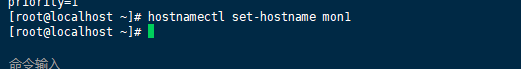

### 一、下载并安装CentOS

过程：

1.阿里云上下载CentOS镜像

http://mirrors.aliyun.com/centos/7/isos/x86_64/

2.下载完成后打开VMware软件

创建新的虚拟机admin—选择最小安装-添加用户并设置相应密码

### 二、准备工作

**1.给创建的用户配置sudo权限**

先进入CentOS中，再用命令`ip addr`查看ip地址，用FinaShell进行SSH连接，这样界面较为直观，且命令输入方便快捷

用到的命令：

`echo "cephuser ALL = (root) NOPASSWD:ALL" | sudo tee /etc/sudoers.d/cephuser`
`chmod 0440 /etc/sudoers.d/cephuser`
`sed -i s'/Defaults requiretty/#Defaults requiretty'/g /etc/sudoers`

过程：

**2.安装配置ntp服务**

用到的命令：

`yum install -y ntp ntpdate ntp-doc`
`ntpdate 0.us.pool.ntp.org`
`hwclock --systohc`
`systemctl enable ntpd.service`
`systemctl start ntpd.service`

过程：

**3.禁用SELINUX**

用到的命令：

`sed -i 's/SELINUX=enforcing/SELINUX=disabled/g' /etc/selinux/config`

**4.防火墙设置**

用到的命令：

`systemctl start firewalld`
`systemctl enable firewalld`

完成以上准备工作后，复制三台同样虚拟机，并更名为mon1、osd1、osd2

**分别配置防火墙：**

<1>主控节点防火墙
`sudo firewall-cmd --zone=public --add-port=80/tcp --permanent`
`sudo firewall-cmd --zone=public --add-port=2003/tcp --permanent`
`sudo firewall-cmd --zone=public --add-port=4505-4506/tcp --permanent`
`sudo firewall-cmd --reload`

<2>monistor节点防火墙
`sudo firewall-cmd --zone=public --add-port=6789/tcp --permanent`
`sudo firewall-cmd --reload`

<3>普通节点防火墙
`sudo firewall-cmd --zone=public --add-port=6800-7300/tcp --permanent`
`sudo firewall-cmd --reload`

### 三、主控节点配置

**1.添加配置**

`vi /etc/hosts`

su - 

**2.设置免密登陆**

`su - cephuser`

**3.生成密钥**

`ssh-keygen`

**4.配置**

`vi ~/.ssh/config`
<!--#添加如下配置-->
Host ceph-admin
        Hostname ceph-admin
        User cephuser

Host mon1
        Hostname mon1
        User cephuser

Host osd1
        Hostname osd1
        User cephuser

Host osd2
        Hostname osd2
        User cephuser

<!--把密钥复制给各个节点-->

`chmod 644 ~/.ssh/config`

`ssh-keyscan osd1 osd2 mon1 >> ~/.ssh/known_hosts`

`ssh-copy-id ceph-admin`
`ssh-copy-id mon1`
`ssh-copy-id osd1`
`ssh-copy-id osd2`

**5.测试连接各节点ssh**

`ssh ceph-admin`
`ssh osd1`
`ssh osd2`
`ssh mon1`

**6.ceph-deploy安装**

`sudo yum update && sudo yum install ceph-deploy`

**7.创建集群**

`mkdir cluster && cd cluster`
`ceph-deploy new mon1`
`vi ceph.conf`

`osd pool default size = 2`
`public network = {ip-address}/{netmask}`

`ceph-deploy install ceph-admin mon1 osd1 osd2`

**8.添加ceph仓库**

`sudo vi /etc/yum.repos.d/ceph.repo`<!--#添加如下配置-->

[ceph]
name=Ceph packages for $basearch
baseurl=http://mirrors.163.com/ceph/rpm-jewel/el7/$basearch
enabled=1
gpgcheck=0
priority=1
type=rpm-md
gpgkey=http://mirrors.163.com/ceph/keys/release.asc

[ceph-noarch]
name=Ceph noarch packages
baseurl=http://mirrors.163.com/ceph/rpm-jewel/el7/noarch
enabled=1
gpgcheck=0
priority=1
type=rpm-md
gpgkey=http://mirrors.163.com/ceph/keys/release.asc

[ceph-source]
name=Ceph source packages
baseurl=http://mirrors.163.com/ceph/rpm-jewel/el7/SRPMS
enabled=0
gpgcheck=0
type=rpm-md
gpgkey=http://mirrors.163.com/ceph/keys/release.asc
priority=1

`yum -y install ceph ceph-radosgw`

**9.mon1节点**

下面这一句需要mon1节点执行，修改主机名为mon1

`hostnamectl set-hostname mon1`

`ceph-deploy mon create-initial`

`ceph-deploy gatherkeys mon1`

报错解决：https://blog.whsir.com/post-4604.html

### 四、为osd守护进程创建目录

osd1节点：
`sudo mkdir /var/local/osd1`
`sudo chown ceph: /var/local/osd1`

osd2节点：
`sudo mkdir /var/local/osd2`
`sudo chown ceph: /var/local/osd2`

admin：

`ceph-deploy osd prepare osd1:/var/local/osd1 osd2:/var/local/osd2`

`ceph-deploy osd activate osd1:/var/local/osd1 osd2:/var/local/osd2`

`ceph-deploy admin ceph-admin mon1 osd1 osd2`

`sudo chmod 644 /etc/ceph/ceph.client.admin.keyring`

### 五、检查集群状态

`ssh mon1`
`sudo ceph health`
`sudo ceph -s`

**<u>成功完成</u>**

安装参考：https://www.howtoforge.com/tutorial/how-to-build-a-ceph-cluster-on-centos-7/