### 一、安装Docker

用到的命令：

`yum check-update`更新应用程序数据库；

`curl -fsSL https://get.docker.com/ | sh`下载安装Docker；

`systemctl start docker`启动Docker；

`systemctl status docker`验证Docker是否成功启动；

`systemctl enable docker`开机自启；

`docker version`查看Docker版本；

过程：

1.更新应用程序数据库

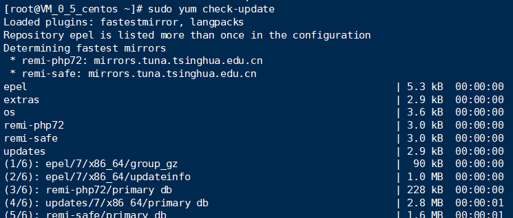

2.安装Docker

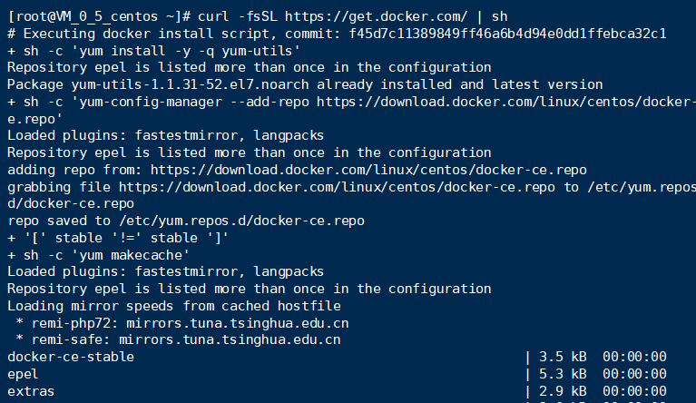

3.启动Docker

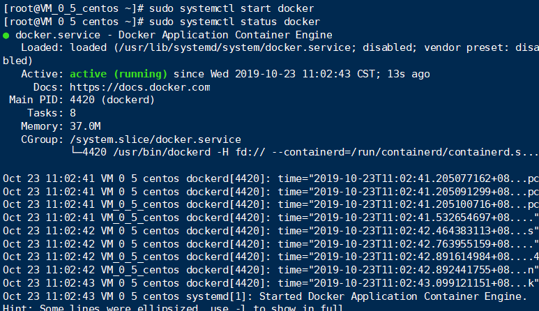

4.设置开机自启

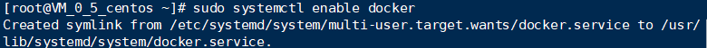

5.查看Docker版本

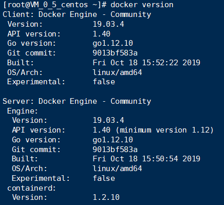

### 二、加载CentOS镜像

用到的命令：

`docker pull centos:7`拉取镜像

`docker images`查看镜像

`docker run -d -it --privileged --name 123 -p 8888:80 -d centos:7 /usr/sbin/init`运行Docker容器

`docker ps`查看已启动的容器

`docker exec -it d53 /bin/bash`进入容器前台

过程：

1.拉取镜像

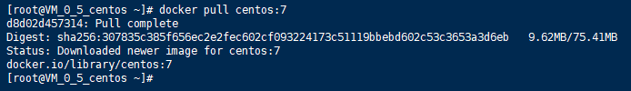

2.查看镜像

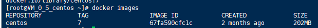

3.运行Docker容器

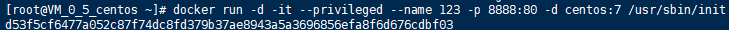

4.查看已经启动的容器

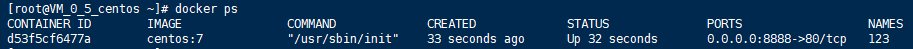

5.进入容器前台(**这边的d53是容器ID的前三位**)

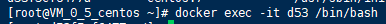

### 三、容器中安装wordpress

与实验一的安装过程一致，详情请参照：

[Website](/Website/README.md)

1.容器中安装apache

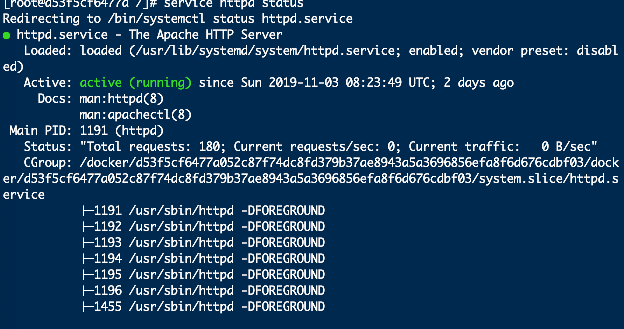

2.容器中安装php

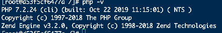

3.容器中安装Mysql

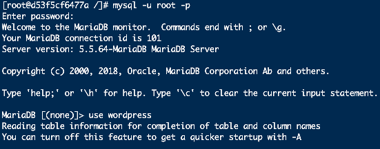

本地浏览器进入localhost:8888查看是否成功

成功截图：

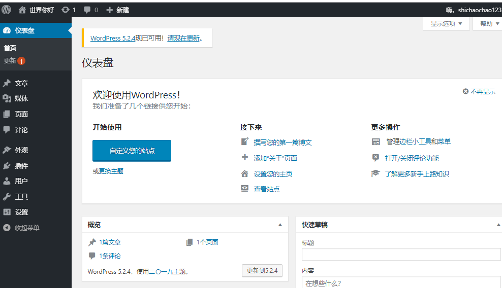

### 四、推送带有WordPress的CentOS镜像推送到容器仓库

**准备工作：先百度Docker进入官网注册账号，后续操作要用到**

用到的命令:

1.`docker commit -a "Docker用户名" -m "提交描述" 容器id 镜像名:tag标签`将容器生成镜像

ex:`docker commit -a "570521784" -m "wordpress on centos7"d53f5cf6477a 570521784/centos:7`

------

2.`docker login`登陆Docker

------

3.`docker push 镜像名:tag标签`推送镜像

ex:`docker push 570521784/centos:7`

------

过程：

1.将容器生成镜像

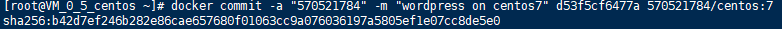

2.登陆Docker

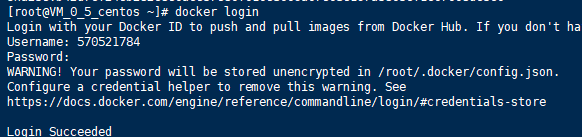

3.推送镜像(这一步持续时间比较久)

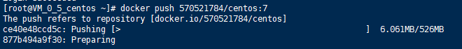

4.登录Docker网页查看仓库

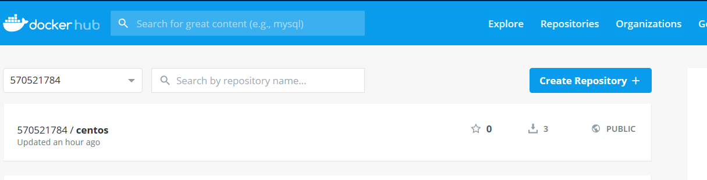

