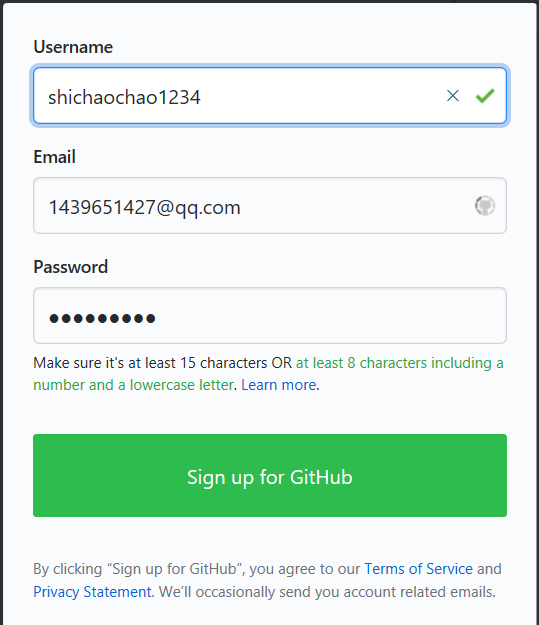

### **一、购买腾讯云服务器并登录**

1.购买腾讯云服务器（学生套餐）

2.使用web shell登陆腾讯云服务器

(登陆成功)

3.下载安装xshell

4.使用xshell登录腾讯云服务器

①输入主机号②输入用户名，密码③成功登录

### 二、创建GitHub项目并在本地同步

**准备工作：**

①安装git并配置ssh

②配置GitHub的用户名和邮箱

1.注册GitHub账号

2.创建仓库CloundComputing

3.定位同步的GitHub项目文件夹、添加远程代码仓库url及验证添加是否成功

4.从远程仓库拉取数据、新建README文档、添加文件夹所有文件

**注：README文档中已添加数据“hello world”**

5.提交文件并推送本地更新到远程服务器

(成功推送)

### 三、本地安装VMware Workstation和CentOS操作系统

1.前往https://www.vmware.com/cn.html下载VMware Workstation并安装

2.下载CentOS在桌面（方便添加）打开VMware workstation创建新虚拟机

3.命名虚拟机并设置磁盘大小

4.选择中文并设置安装位置

5.创建root密码和用户名

6.设置完成后开机即可

(成功开机)