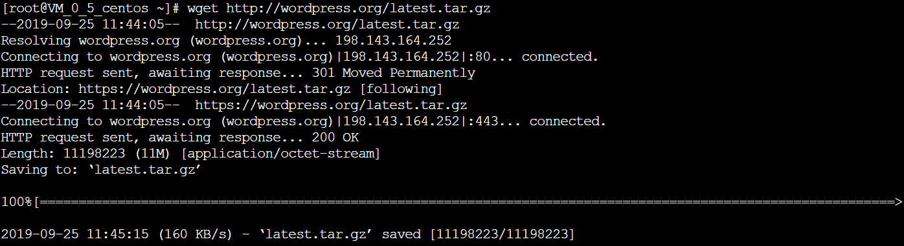

### 一.安装Apache Web服务器

**用到的命令：**

sudo yum install httpd（安装）

sudo systemctl start httpd.service（启动）

**过程：**

1.安装并启动Apache Web服务器

2.在本机输入腾讯云实例的公有ip地址出现下列画面则运行正常

### 二、安装MySQL

**用到的命令：**

sudo yum install mariadb-server mariadb（安装命令）

sudo systemctl start mariadb（启动命令）

sudo mysql_secure_installation（启动交互脚本）**注：设置相应的root访问密码以及相关的设置(都选择Y)**

sudo systemctl enable mariadb.service（开机启动MariaDB命令）

**过程：**

1.安装MariaDB和启动mariadb：

2.启动交互脚本

3.设置开机启动

### 三、安装PHP

**用到的命令：**

sudo yum install epel-release yum-utils
sudo yum install http://rpms.remirepo.net/enterprise/remi-release-7.rpm（启用仓库）

sudo yum-config-manager --enable remi-php72（启用PHP 7.2 Remi仓库）

sudo yum install php php-mysql（安装PHP以及php-mysql）

php -v和sudo systemctl restart httpd.service（查看安装的php版本并重启Apache服务器以支持PHP）

**过程：**

1.启用两个仓库Remi和EPEL

2.启用PHP 7.2 Remi仓库

3.安装PHP以及php-mysql

4.查看安装的php版本并重启Apache服务器以支持PHP

### 四、安装PHP模块

**用到的命令**：

yum search php-（查看可用模块）

sudo yum install php-fpm php-gd(安装php-fpm和php-gd)

sudo service httpd restart(重启Apache服务)

**过程：**

1.查看可用模块

2.安装php-fpm和php-gd

3.重启Apache服务

### 五、测试PHP

**用到的命令：**

sudo vim /var/www/html/info.php（创建info.php并将其置于Web服务的根目录）

<?php phpinfo(); ?>（添加内容到info.php）

**过程：**

1.使用刚才获取的cvm的IP地址，在你的本地主机的浏览器中输入得到测试成功图片

**(测试成功图)**

### 六、**安装WordPress以及完成相关配置**

**用到的命令：**

mysql -u root -p（登陆MySQL数据库）

CREATE DATABASE wordpress（创建一个新的数据库）

CREATE USER wordpressuser@localhost IDENTIFIED BY 'password'（创建一个独立的MySQL用户）

GRANT ALL PRIVILEGES ON wordpress.* TO wordpressuser@localhost IDENTIFIED BY 'password'（使用你自定义的用户名和密码。授权给wordpressuser用户访问数据库的权限）

FLUSH PRIVILEGES（刷新MySQL权限）

**过程：**

1.登陆MySQL数据库

2.创建一个新的数据库

3.刷新MySQL权限并退出

### 七、安装**WordPress**

**用到的命令：**

cd ~
wget http://wordpress.org/latest.tar.gz（下载WordPress至当前用户的主目录）

tar xzvf latest.tar.gz（wget命令从WordPress官方网站下载最新的WordPress集成压缩包，解压该文件）

sudo rsync -avP ~/wordpress/ /var/www/html/（使wordpress的内容能够被访问）

mkdir /var/www/html/wp-content/uploads（在Apache服务器目录下为wordpress创建一个文件夹来保存上传的文件）

sudo chown -R apache:apache /var/www/html/*（对Apache服务器的目录以及wordpress相关文件夹设置访问权限）

**过程：**

1.下载WordPress至当前用户的主目录并解压文件

2.使wordpress的内容能够被访问

3.在Apache服务器目录下为wordpress创建一个文件夹来保存上传的文件

4.对Apache服务器的目录以及wordpress相关文件夹设置访问权限

### 八、配置WordPress

**用到的命令：**

cd /var/www/html（定位到wordpress所在文件夹）

cp wp-config-sample.php wp-config.php（生成wp-config.php）

vi wp-config.php（修改配置）

**过程：**

1.定位到wordpress所在文件夹

2.cp wp-config-sample.php wp-config.php（生成wp-config.php）

3.vi wp-config.php

### 九、**通过Web界面进一步配置WordPress**

**用到的命令：**

http://server_domain_name_or_IP（Web页面进一步配置、输入你的IP地址或者域名）

**过程：**

1.输入ip地址（没有域名）

2.设置网站的标题，用户名和密码以及电子邮件等，点击**Install WordPress**，弹出确认页面,确认后点击login in

3.输入用户名和密码之后，进入WordPress的控制面板并稍作完善（**ip名106.54.29.191**）

